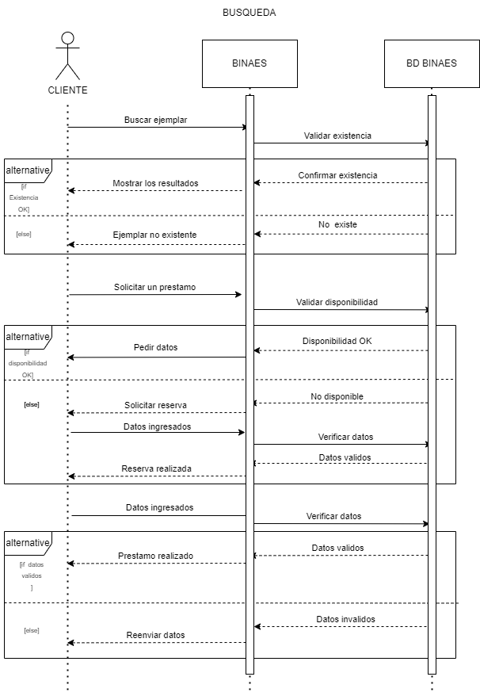
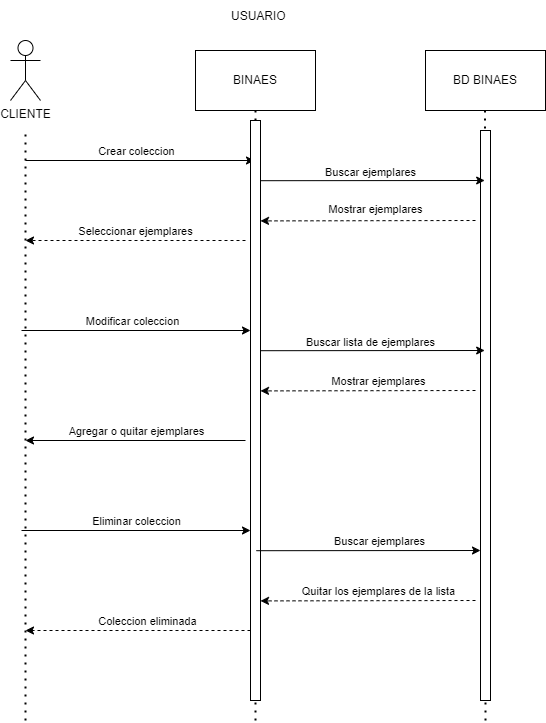
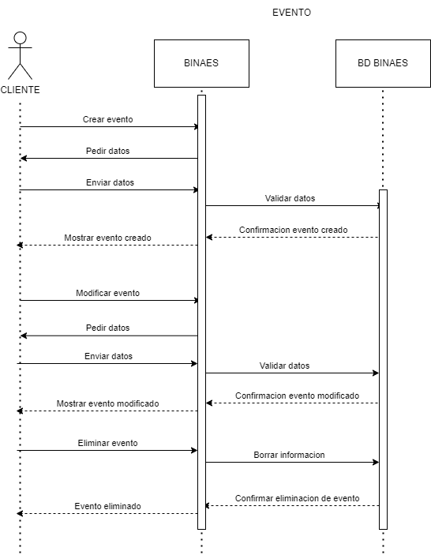
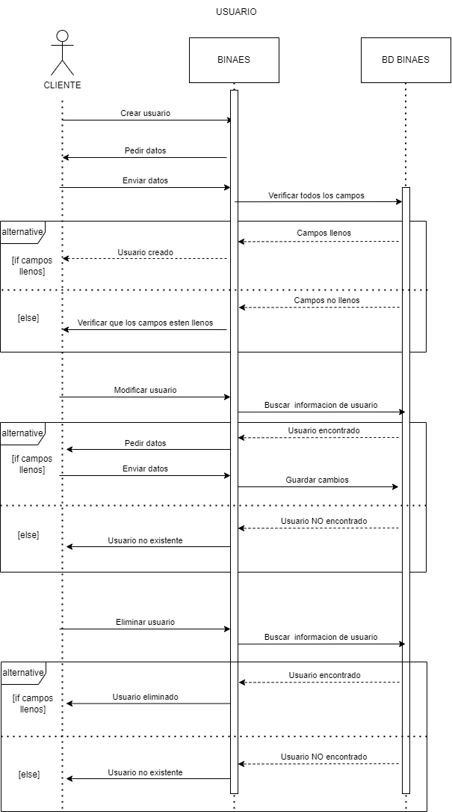
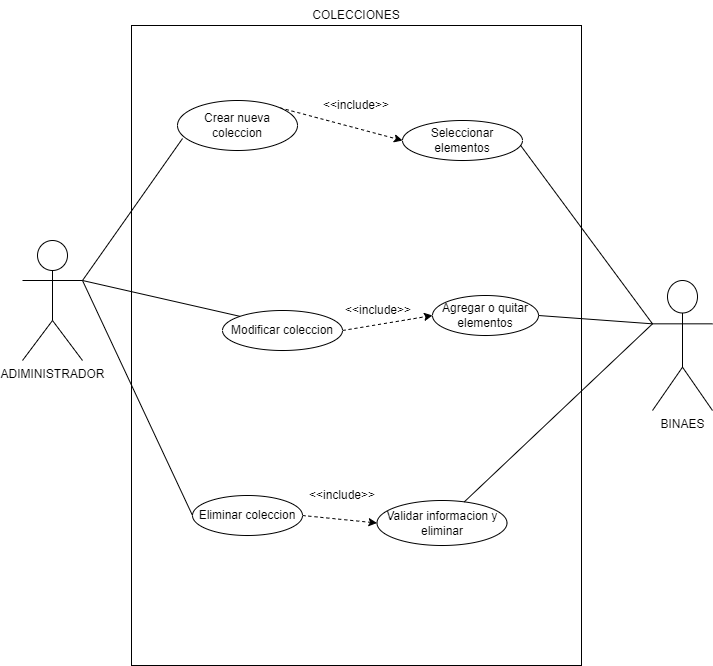
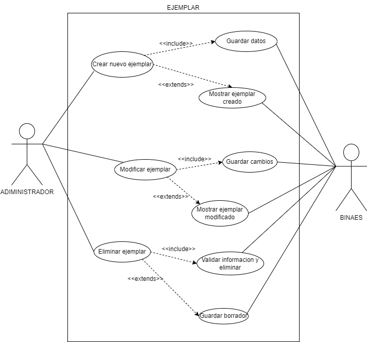
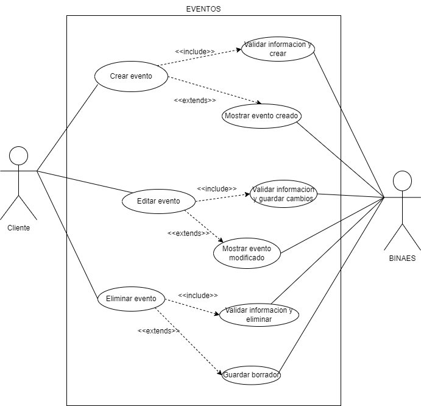
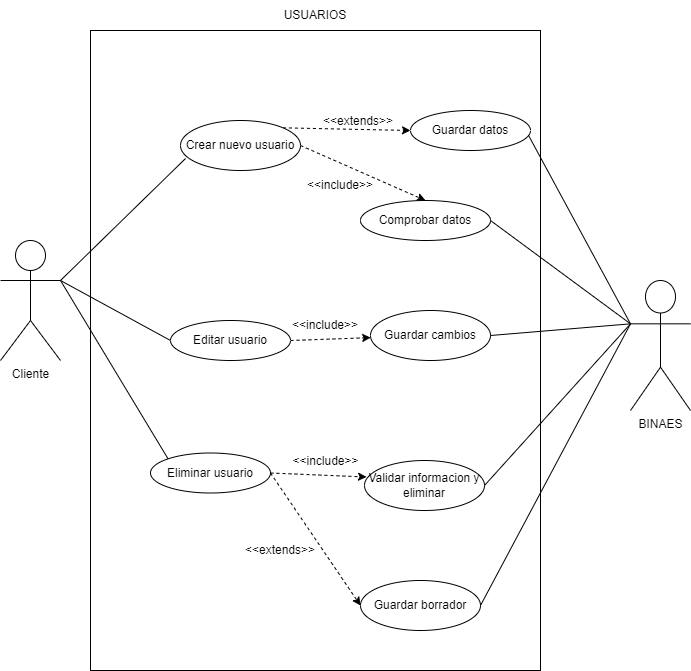
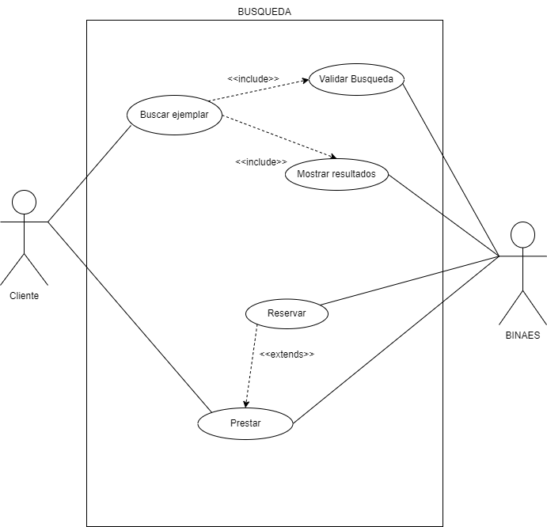

# **MANUAL TÉCNICO**

# Requerimientos técnicos 

## Herramientas utilizadas para el desarrollo

- **Sistema de gestión de bases de datos:** 
    - Microsoft SQL Server 2019 (versión 15.0)
- **Gestor para SQL Server:** 
    - Azure data studio (versión 1.36.2)
- **Entorno de desarrollo integrado:**     
    - Visual studio code community 2022 (versión 17.0)
    - JetBrains Rider (versión 2022.1)
- **Lengua de programación:** 
    - C# Netframework 4.8
- **Sistemas operativos:**
    - Windows 10 home
    - Windows 11  
- **Adicional:**
    - Entity Framework
    - Docker 

# Diagramas

## UML CLASES

## UML SECUENCIA

1. Búsqueda

2. Colección

3. Evento

4. Usuario

## UML USO

1. Colecciones

2. Ejemplares

3. Evento

4. Usuario

5. Búsqueda

