# Descripción del software #

El software será la interfaz a utilizar para la nueva biblioteca que se construirá en el país próximamente llamada **"BINAES"**.
Cuenta con distintas ventanas en donde podrá observar la pantalla de bienvenida, la zona de búsqueda personalizada, de ahí se podrá realizar las reservas y prestamos cuando el usuario haya elegido el ejemplar a prestar.

# Formularios y controlares

## **Formularios**

### **1.** **Login**
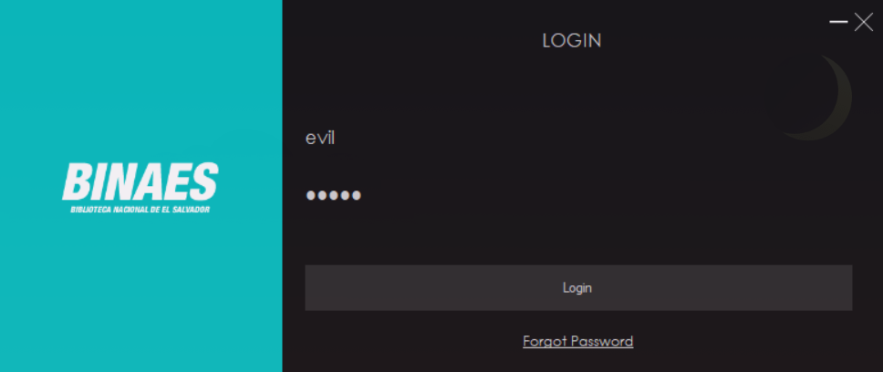

**Descripción:**

El formulario "Login" es lo primero que se verá al iniciar la aplicación, en esta ventana se ingresarán los datos del usuario, escribiendo primero el nombre de usuario, después la contraseña y a continuación darle clic en "login". 
Los usuarios administradores podrán editar, eliminar, añadir: tanto colecciones como usuarios y eventos.
Para cerrar el programa solo darle el clic a la "x" y listo.

### **2.** **Home**
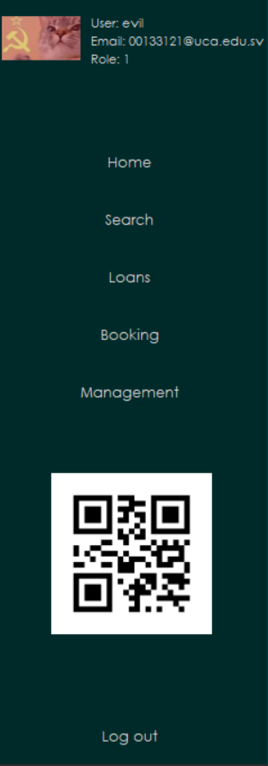

**Descripción:**

En la zona de "Home", lo primero que hay es: 
- **Los datos del usuario:** Donde se observan el nombre de usuario, el correo y el rol.
- **Home:** Botón de Home.
- **Seach:** Botón que dirige a la ventana de Búsqueda.
- **Loans:** Botón que dirige a la ventana de Prestamos.
- **Booking:** Botón que dirige a la ventana de reservas.
- **Management:** Botón que dirige a la ventana de Administración.
- El código QR del usuario.
- **Log out:** El botón para cerrar la sesión

En esta parte solo se tiene que hacer clic en cada botón para que sea dirigido a las otras ventanas.

### **3.** **Welcome**
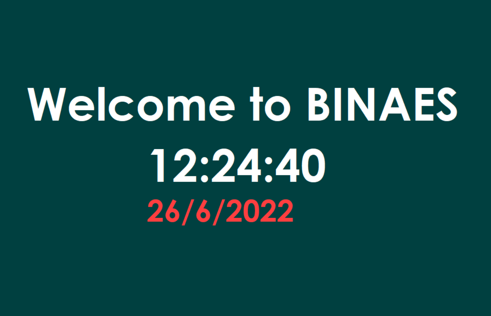

**Descripción:**

Esta ventana solo mostrará el mensaje de bienvenida a la aplicación, mostrará también la hora actual junto con su fecha.

### **4.** **Search**
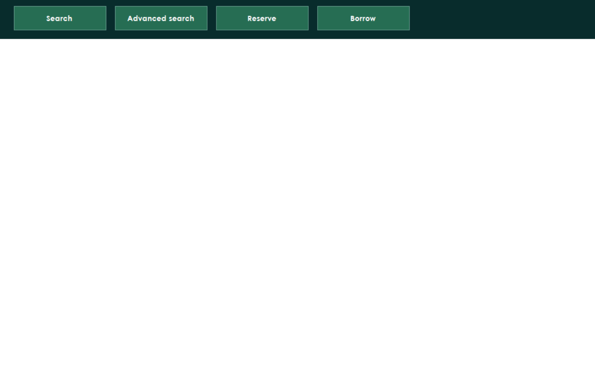

**Descripción:**

Dando clic al segundo botón (Search) abrirá la zona de búsqueda de los ejemplares disponibles en la biblioteca. Cuenta con 4 botones principales que al darles clic abrirán las distintas ventanas de los botones. Que son:
- **Search:** Botón que abrirá la ventana de búsqueda general de los ejemplares.
- **Advanced search:** Botón de la búsqueda avanzada de los ejemplares.
- **Reserve:** Botón que abrirá la ventana de reservas de los ejemplares.
- **Borrow:**  Botón que abrirá la ventana de préstamos de los ejemplares.

### **5.** **Management**
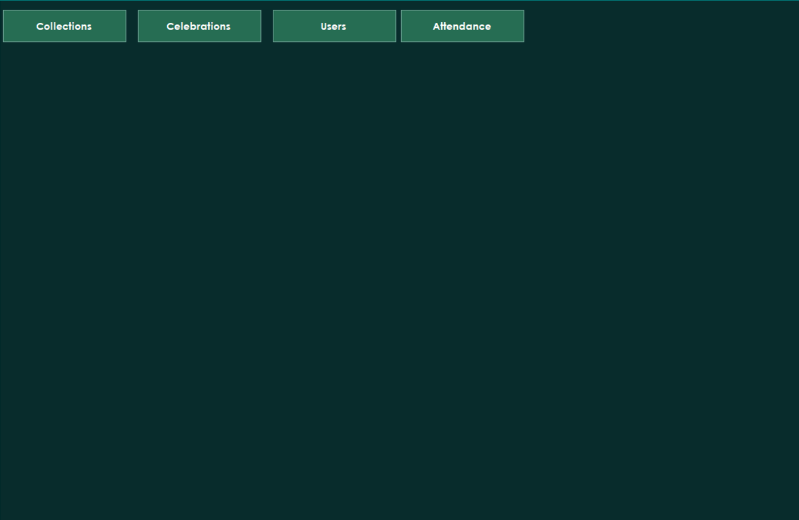

**Descripción:**

El botón de "Management" es para usuarios administradores en donde al darle clic se dirigirá a la ventana donde el usuario podrá:
- **Con el botón de Collections:** Abrir la ventana de las colecciones.
- **Con el botón de Celebrations:** Abrir la ventana en donde estan los eventos.
- **Con el botón de Users:** Abrirá la ventana en donde estan los usuarios.

**Descripción:**

## **Controladores**

Ventanas que aparecerán cuando se de clic a los distintos botones de los formularios.

### **8.** **Search**
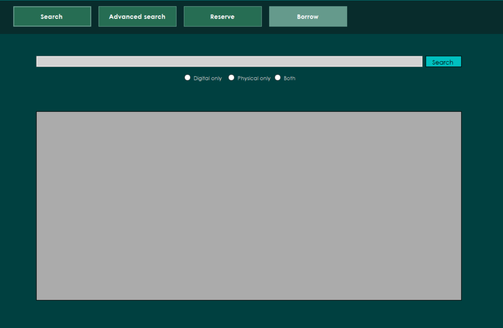

**Descripción:**

El segundo botón del Home llamado "Search" al darle clic abrirá una ventana que cuenta con 4 botones. El primer botón al darle clic abrirá la búsqueda general de los ejemplares.
El usuario notará distintos botones:

1.**Barra de búsqueda:** Aquí se podrá escribir el título del ejemplar a buscar.

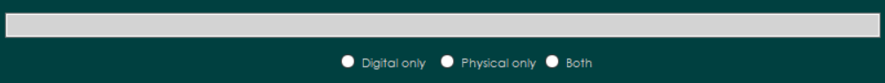

2.**Botón Search:** Con el botón Search al darle clic empezará la búsqueda.
También se puede escoger si queremos que nuestro ejemplar sea en formato digital, físico o ambas. Damos clic a solo uno de las opciones y presionamos el botón de buscar (search).

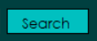

3.**Resultados:** Desplegará una lista de los ejemplares existentes en la biblioteca.

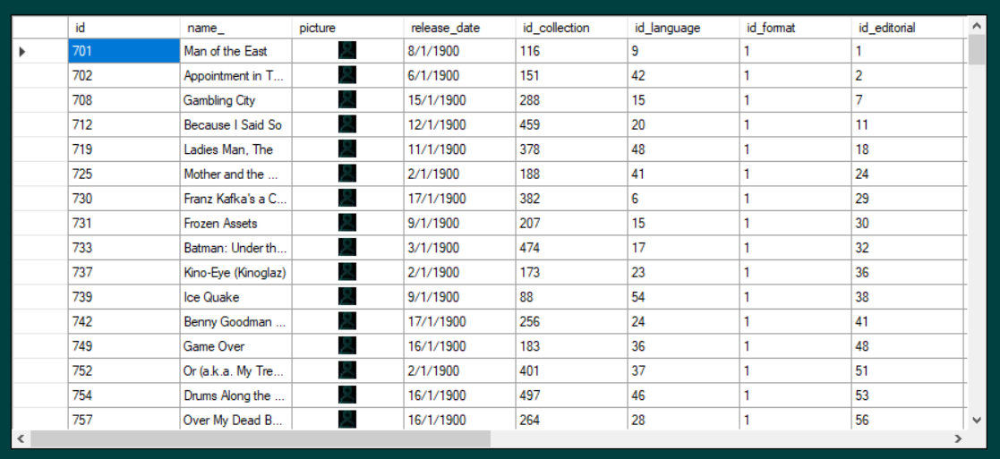

### **9.** **Advanced Search**
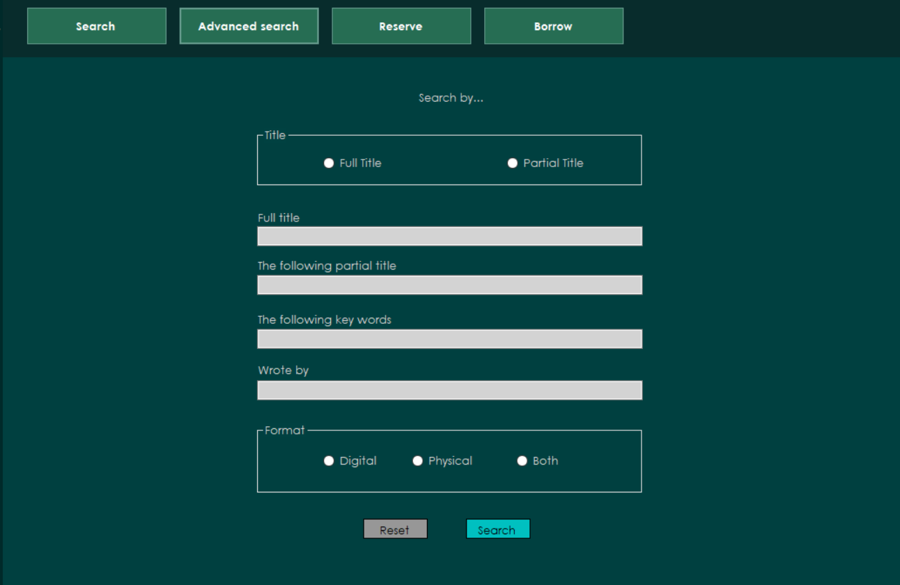

**Descripción:**

1.**Tittle:** Aquí deberá escoger si quiere buscar el título por su nombre completo o solo una parte de él (por si no se acuerda del nombre).

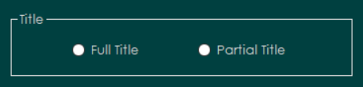

2.**Full tittle and Partial tittle:** Según lo escogido en el apartado anterior:
- Si escogió "Full tittle" usted podrá escribir en donde lleva ese nombre (full tittle).
- En cambio si escogió solo parte del titulo se le habilitará solamente esa opción.

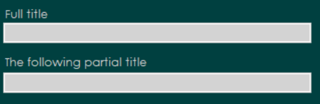

3.**Format:** En este pequeño menú podrá escoger si quiere que su ejemplar sea de formato digital, físico o ambos. Solo se escogerá una opción.

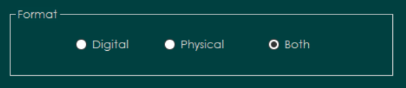

4.**Key words and wrote by:** Aquí se deberá ingresar el username.

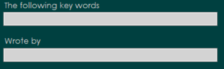

- **Key words:** Aquí usted podrá realizar la búsqueda de su ejemplar por palabras claves.
- **Wrote by:** En esta parte se deberá ingresar el nombre del autor del ejemplar.

5.**Botones:** Los cuales:

- **Resert:** Este botón reiniciará y limpiará la información que se haya escrito. Si usted como usuario quiere eliminar el titulo y en general las opciones que haya cambiado, tendría que presionar este botón.
- **Search:** Una vez ingresado todos los datos del ejemplar que se quiere, presione este botón para realizar la búsqueda.
- **Select:** Si el ejemplar está en la biblioteca y lo quiere solicitar para un préstamo, presionar este botón.

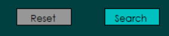

### **10.** **Reserve**
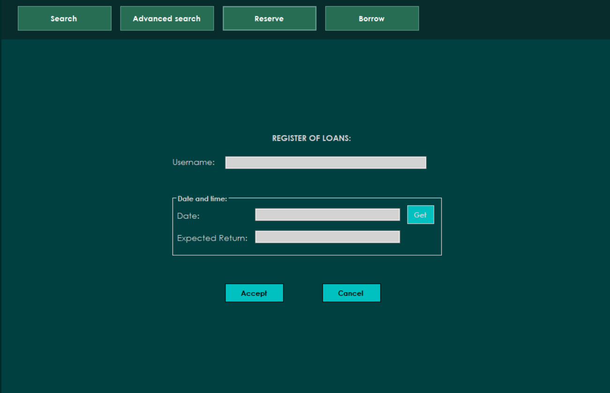

**Descripción:**
En esta pantalla se realizarán las reservas de los ejemplares de la biblioteca. En donde: 

1.**User:** Aquí se deberá ingresar el username.

2.**Date and time:** Aquí se almacenará la fecha y hora en la que se realizó la reserva. El botón "Get" guardará la hora y fecha actual y en el "Expected return" se mostrará la fecha estimada para que devuelva el libro. Teniendo un limite de 15 días.

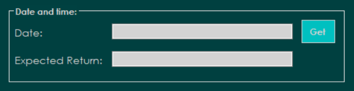

3.**Botones**: Estos hacen lo siguiente: 
- Aceptar: Cuando se dé clic en este botón automáticamente la reserva se guardará.
- Cancel: Aquí la reserva se anula y no la realiza.

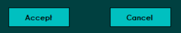

### **11.** **Borrow**
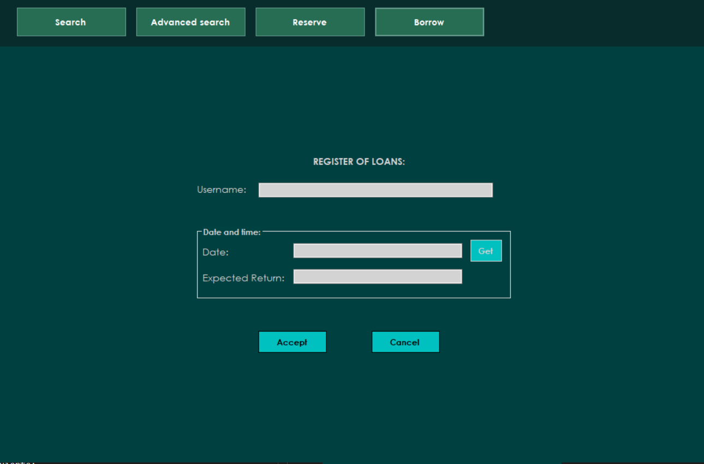

**Descripción:**
En esta pantalla se realizarán los prestamos de los ejemplares de la biblioteca. En donde: 

1.**User:** Aqui se deberá ingresar el username.

2.**Date and time:** Aquí se almacenará la fecha y hora en la que se realizó la reserva. Y se trabaja del mismo modo que la ventana de reservas.

3.**Botones**: Estos hacen lo siguiente: 
- Aceptar: Cuando se dé clic en este botón automáticamente el préstamo se guardará.
- Cancel: Aquí el préstamo se anula y no se realiza.

### **12.** **Users**
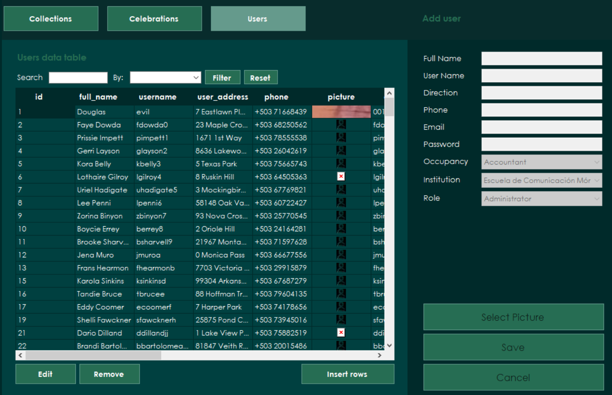

**Descripción:** Los usuarios administradores podrán editar, eliminar; tanto las colecciones, los eventos y los usuarios. Como, por ejemplo:

1.**Botón para editar los usuarios**: Al presionar este botón el usuario administrador podrá eliminar, también editar todos los campos de los usuarios, también se podrá añadir a nuevos usuarios.

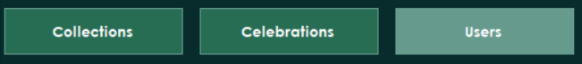

2.**Añadir:** Aquí se está añadiendo a un usuario: En donde aparecen los campos relacionados al nuevo usuario: Como por ejemplo su nombre completo, el username que se le ha otorgado, su dirección, etc.

Al terminar de rellenar los campos solo deberá presionar los tres botones de la parte de abajo, en donde cada uno hace lo siguiente:

- **Select picture:** Para seleccionar la fotografía del nuevo usuario.
- **Save:** Este botón guardará los cambios realizados en el formulario.
- **Cancel:** Cancelará la acción que se ha escogido y no realizara ningún cambio.

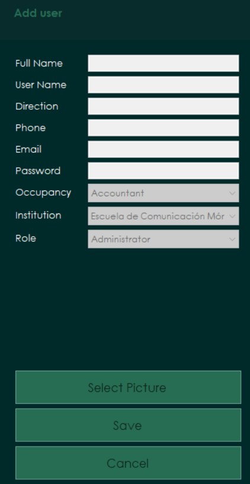

4.**Cuadro de resutados:** En esta parte del programa se mostrarán los resultados de los usuarios que ya estan registrados. Dentro de la lista también se podrá realizar una búsqueda especifica si se quiere realizar. También se podrá reiniciar si se ha realizado una búsqueda especifica.

Los Botones de la parte de abajo son para la edición de un nuevo usuario, como también para eliminar algún usuario.

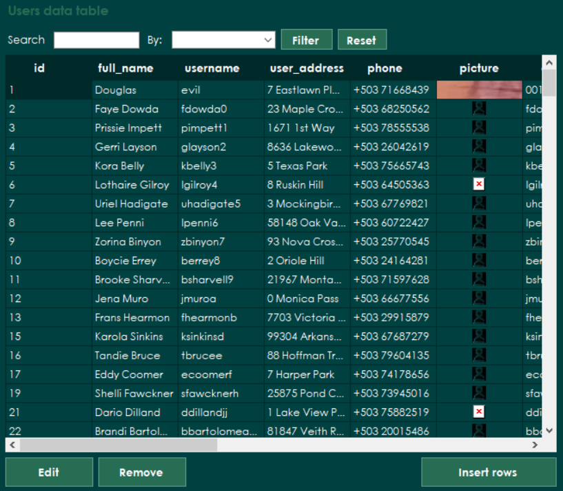

### **13.** **Celebrations**
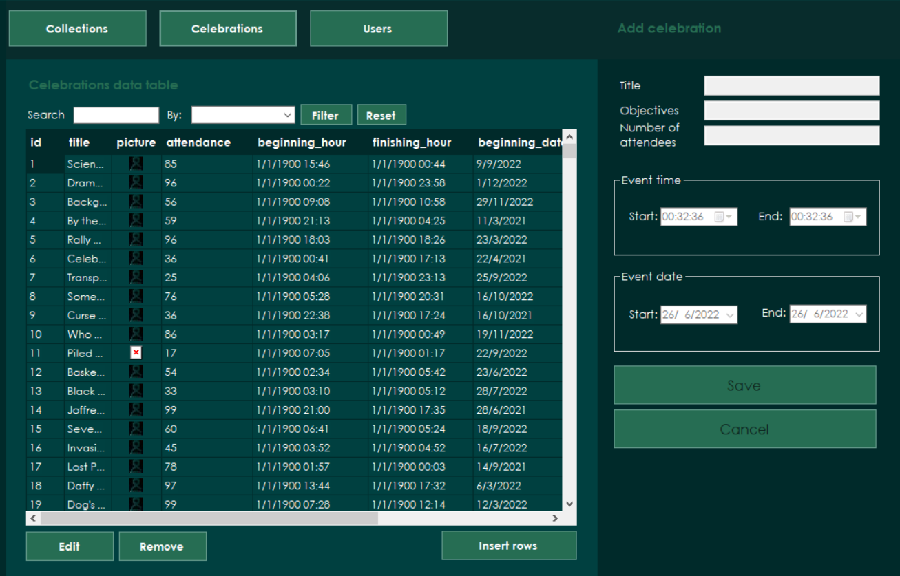

**Descripción:** Al escoger el botón de los ejemplares el usuario administrador será dirigido a la ventana donde podrá editar, eliminar ejemplares, así como añadir uno nuevo.

1.**Añadir:** Aquí se deberán rellenar los campos y una vez colocada la información se podrá seleccionar los siguientes botones para:

- **Save:** Este botón guardará los cambios realizados en el formulario.
- **Cancel:** Cancelará la acción que se ha escogido y no realizara ningún cambio.

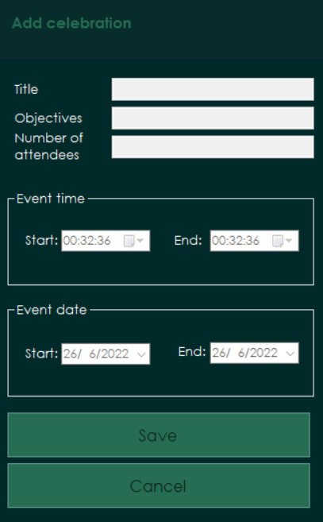

2.**Cuadro de resutados:** En esta parte del programa se mostrarán los resultados de los usuarios que ya estan registrados. Esta parte del programa es igual a la de los usuarios con los mismos botones de editar y eliminar solo que tratando a los ejemplares.

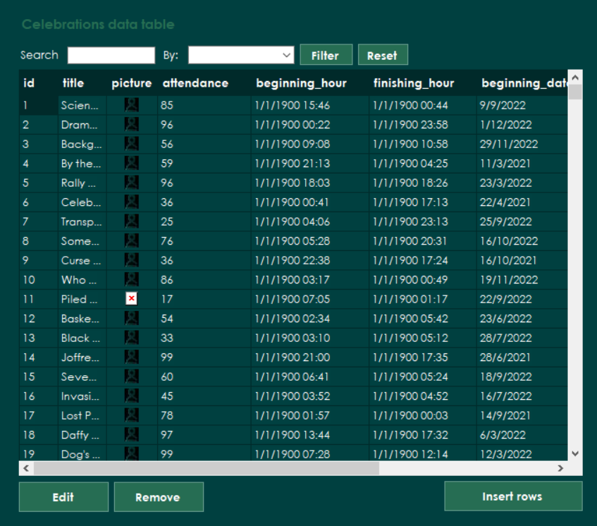

### **14.** **Colletions**

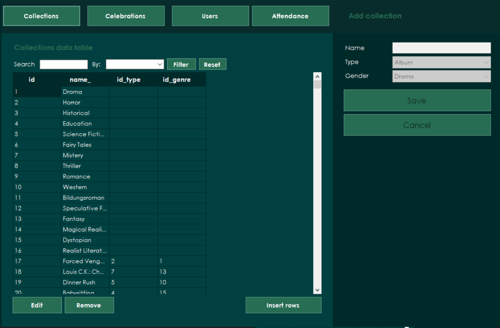

**Descripción:** Aquí el usuario podrá editar las colecciones de los ejemplares.

1.**Lista de ejemplares en la biblioteca:** Aquí se mostrará los ejemplares que estan en la biblioteca. Mostrando su id, su nombre y todo lo necesario de las colecciones.

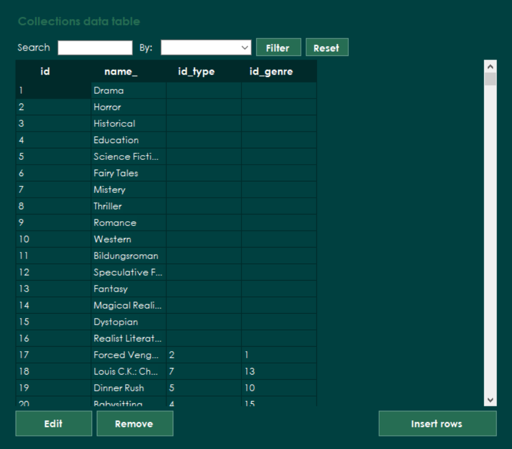

2.**Añadir una colección:** En esta parte el usuario administrador podrá agregar las colecciones que crea necesarias, añadiendo su nombrel, su tipo y su género.

Para guardarlo solamente se le tiene que dar clic en el botón de "save" y para cancelar cualquier acción al botón de "Cancel"

